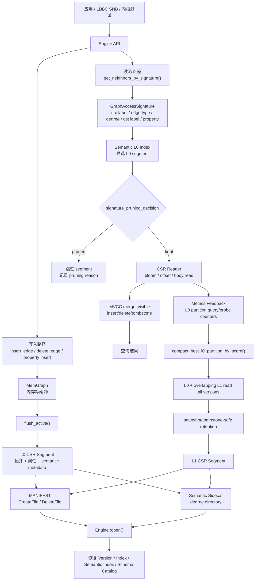

# LSMGraph 干净内核架构文档

> 分支：`codex/k4-clean-kernel`
>
> 目录：`/data/WorkSpace/lsmgraph-rs-clean-kernel`
>
> 范围：本文只描述 DB 内核、存储格式、查询路径、写入路径、语义剪枝边界、
> K4 lifecycle API 和当前验证边界。论文草稿、实验脚本、baseline trace、
> 绘图文件和一次性 runner 不属于这个干净分支。

## 1. 主线目标

这个分支先完成了“干净 DB 内核分支”，随后在内核里补了一个最小完整的
K4 lifecycle API。当前目标不是把所有论文实验都放进这个分支，而是让
LSMGraph 内核本身具备一条可验证的 DB-native 生命周期链路：

```text
write -> flush -> semantic metadata -> read pruning -> feedback
      -> merge/compaction -> schema-safe recovery/reopen
```

当前实现落点是：

```rust
Engine::run_k4_lifecycle(signatures)
Engine::run_k4_lifecycle_with_repetitions(signatures, repetitions)
```

它会使用真实 Engine 路径完成：

1. flush 当前 MemGraph 写入。
2. 持久化 semantic sidecar。
3. 执行 query signatures，触发 segment-level read pruning。
4. 记录 L0 partition feedback。
5. 根据 feedback 选择 hot L0 partition 并 merge 到 L1。
6. 再次持久化 semantic sidecar。
7. 通过 manifest、schema catalog、sidecar 支持 reopen 后恢复。

注意：SNB HTTP server 的 mixed update workload 目前还没有自动触发这条
K4 lifecycle。当前 K4 是 Engine 层能力，SNB 集成是后续工作。

## 2. 系统流程图



## 3. 分支边界

保留内容：

| 路径 | 作用 |
|---|---|
| `src/` | DB 内核、SNB 服务路径、存储引擎、IO backend |
| `tests/` | 内核回归测试 |
| `Cargo.toml`, `Cargo.lock` | Rust 构建定义 |
| `README.md`, `README-cn.md` | 项目入口说明 |
| `LSMGRAPH-ARCHITECTURE.md` | 本架构文档 |
| `LSMGRAPH-STARTUP-GUIDE.md` | 启动和验证说明 |
| `CLEAN-KERNEL-INVENTORY.md` | 干净分支清单 |

移除内容：

| 路径 / 类型 | 移除原因 |
|---|---|
| `baseline/` | 历史实验脚本、结果、报告、trace |
| `scripts/` | 一次性实验和分析 runner |
| `figures/` | 论文图片，不是内核源码 |
| `docs/` | 历史证据归档，不是当前内核文档 |
| 顶层论文/计划 markdown | 论文和项目管理材料 |
| external-system reports | 外部 baseline 调研材料 |
| W/P experiment binaries | 不属于干净 DB 产品入口 |

产品 binary 只保留：

```text
target/release/lsmgraph
```

## 4. 模块分层

```text
Application / LDBC SNB / 内核测试
        |
        v
SNB server / query layer
  - DGS-compatible HTTP endpoints
  - LDBC SNB query/update mapping
        |
        v
Dynamic graph view
  - BaseGraph immutable CSR snapshot
  - DeltaGraph LSM update region
        |
        v
Engine
  - MemGraph write buffer
  - VersionManager MVCC snapshots
  - L0/L1 CSR segment metadata
  - semantic pruning / feedback / K4 lifecycle
        |
        v
CSR storage + IO backend
  - manifest
  - offset arrays / edge bodies / property sections
  - blocking / direct / io_uring backends
```

## 5. 核心模块

| 文件 | 责任 |
|---|---|
| `src/graph.rs` | Engine 主体，写入、flush、读取、semantic index、feedback compaction、K4 lifecycle |
| `src/memgraph/mod.rs` | 内存写缓冲 |
| `src/csr/format.rs` | CSR segment metadata、semantic summary、pruning decision |
| `src/csr/writer.rs` | CSR segment 写入 |
| `src/csr/reader.rs` | CSR segment 读取、bloom/offset/body probe |
| `src/csr/manifest.rs` | manifest replay 和文件生命周期 |
| `src/schema.rs` | schema catalog、epoch、alias/drop/change |
| `src/semantic.rs` | GraphAccessSignature、degree/direction/property predicate |
| `src/metrics.rs` | storage/CSR/SNB/feedback/pruning metrics |
| `src/snb/` | LDBC SNB 查询、HTTP adapter、属性辅助结构 |
| `tests/engine_tests.rs` | Engine 级功能正确性回归 |

## 6. 写入与 Flush

写入入口：

```rust
insert_edge()
delete_edge()
insert_edge_with_properties_prototype()
insert_edge_with_property_values_prototype()
```

写入先进入 `MemGraph`。当 `MemGraph` 满，或者调用 `flush_active()` 时，
Engine 会把当前 MemGraph freeze，创建新的 active MemGraph，并把旧 MemGraph
异步写成 L0 CSR segment。

L0 flush 会写入：

| 内容 | 说明 |
|---|---|
| topology records | `src/dst/edge_type/ts/marker` |
| property sections | property-aware CSR section |
| semantic metadata | src label、dst label、edge type partition、degree class |
| schema epoch | segment 对应的 schema epoch |
| property encoding epoch | property value 的编码 epoch |
| manifest record | `CreateFile { meta }` |

flush 后会更新：

1. `VersionManager` 当前可见版本。
2. L1+ 多级索引。
3. L0 semantic index。
4. degree directory sidecar。

## 7. 查询语义与剪枝

查询入口：

```rust
get_neighbors()
get_neighbors_typed()
get_neighbors_by_signature()
get_neighbors_matching_property_value()
```

语义签名由 `GraphAccessSignature` 表达：

| 字段 | 作用 |
|---|---|
| `src` | 查询源点 |
| `src_label` | 源点 label |
| `edge_type` | 边类型 |
| `direction` | 出边/入边/未知 |
| `degree_class` | Low / Medium / High / Mixed / Unknown |
| `dst_label` | 目标点 label |
| `min_ts`, `max_ts` | 时间范围 |
| `property_predicate` | required property / absent-or-default property |

每个 CSR segment 通过：

```rust
CsrSegmentMeta::signature_pruning_decision()
```

返回：

```rust
SignaturePruningDecision {
    pruned: bool,
    reason: &'static str,
}
```

典型 prune reason：

| reason | 含义 |
|---|---|
| `time` | segment 时间范围不可能匹配 |
| `src_label` | 源点 label disjoint |
| `edge_type` | edge type partition disjoint |
| `direction` | 方向 disjoint |
| `degree` | degree class disjoint |
| `dst_label` | 目标点 label disjoint |
| `property_absence` | segment 精确缺少 required property |

典型 keep/fallback reason：

| reason | 含义 |
|---|---|
| `kept_candidate` | 没有安全剪枝证明 |
| `mixed_unknown_fallback` | metadata mixed/unknown，必须保守读取 |
| `budgeted_not_materialized` | budgeted layout 没有物化该 exact degree partition |
| `schema_tombstone_fallback` | tombstone/schema 风险阻止 property absence pruning |

这些 reason 会进入 `Metrics`，用于解释 pruning 是否真的发生，以及为什么没有发生。

## 8. Feedback 与 K4 Merge

读取 L0 时，Engine 会记录：

| 指标 | 说明 |
|---|---|
| `candidate_l0_segments` | 查询候选 L0 segment 数 |
| `matched_l0_segments` | 实际命中结果的 L0 segment 数 |
| `range_filtered_segments` | 被 src range 过滤的 segment |
| `bloom_filtered_segments` | 被 source bloom 过滤的 segment |
| `l0_partitions` | 按 src label、edge type、range bucket 统计的反馈 |

K4 merge 使用：

```rust
compact_best_l0_partition_by_score()
```

它会从 metrics 中选择 hot L0 partition，读取对应 L0 和 overlap 的 L1，
再通过 snapshot/tombstone-safe retention 生成新的 L1 CSR segment。

这个路径不是 paper runner，而是 Engine 内核 API。新增测试：

```text
k4_lifecycle_flushes_feedback_compacts_and_reopens_schema_safe
```

该测试验证：

1. schema 变更能持久化。
2. 未 flush 的 tombstone 由 K4 lifecycle flush。
3. query signatures 能产生 L0 feedback。
4. feedback compaction 能选择 hot partition。
5. L0 merge 到 L1 后结果仍正确。
6. property value 查询仍正确。
7. reopen 后 schema epoch、manifest、L1 segment、查询结果仍正确。

## 9. Schema 与 Tombstone 安全

Schema catalog 持久化在 store 目录中。每个 segment 带 schema epoch。
查询在新 schema 下访问旧 segment 时，必须遵守 conservative fallback：
只有 metadata 足够精确且不会受到 alias/drop/encoding/tombstone 影响时才允许剪枝。

Tombstone 会隐藏旧版本 insert，因此 compaction 不能简单保留最新记录。
当前 compaction 使用 snapshot/tombstone-safe retention，确保旧 snapshot 和当前
snapshot 都不会读错。

## 10. Recovery / Reopen

`Engine::open()` 会恢复：

| 状态 | 恢复来源 |
|---|---|
| live files | `MANIFEST` replay |
| next file id | manifest 最大 file id |
| max timestamp | live segment max timestamp |
| schema catalog | schema catalog 文件 |
| L1+ index | segment offsets |
| L0 semantic index | L0 metadata + degree directory |
| degree directory | sidecar，缺失时可 rebuild |

K4 的正确性必须包含 reopen，因为只在内存里正确不能证明 DB 生命周期正确。

## 11. LDBC / SNB 验证边界

当前 clean branch 不跟踪 `deps/ldbc_snb_interactive_impls`，这是为了保持分支干净。
验证时可以使用外部已有 LDBC driver 目录，但 binary 使用 clean branch 产物：

```text
/data/WorkSpace/lsmgraph-rs-clean-kernel/target/release/lsmgraph
```

已经完成的验证：

| 验证 | 结果 |
|---|---|
| `cargo test --lib` | 64 passed |
| `cargo test --bin lsmgraph` | 4 passed |
| `cargo test --test engine_tests` | 56 passed, 1 ignored |
| K4 lifecycle 单测 | passed |
| release build | passed |
| Rust `snb-validate --max-lines 20` | checked=20, passed=20, failed=0 |
| Java LDBC mixed validation smoke, `MAX_LINES=5` | Validation Result: PASS |

## 12. 当前未完成项

| 方向 | 状态 |
|---|---|
| SNB mixed update 自动触发 K4 lifecycle | 未实现 |
| 连续后台 LmergePolicy 调度 | 未实现 |
| 多层级 L1/L2/... semantic proof 传播 | 未实现 |
| schema lifecycle cost model | 未实现 |
| metadata downgrade/repair 的显式状态机 | 未实现 |
| paper 级稳定延迟和写放大指标 | 需要后续实验 |

因此，当前分支可以支撑“DB 内核已经具备最小 K4 lifecycle 且功能正确”的说法；
但还不能声称“完整 SNB mixed workload 已经自动走 K4 生命周期”。
