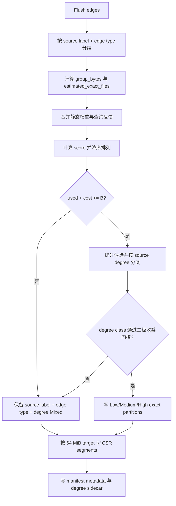
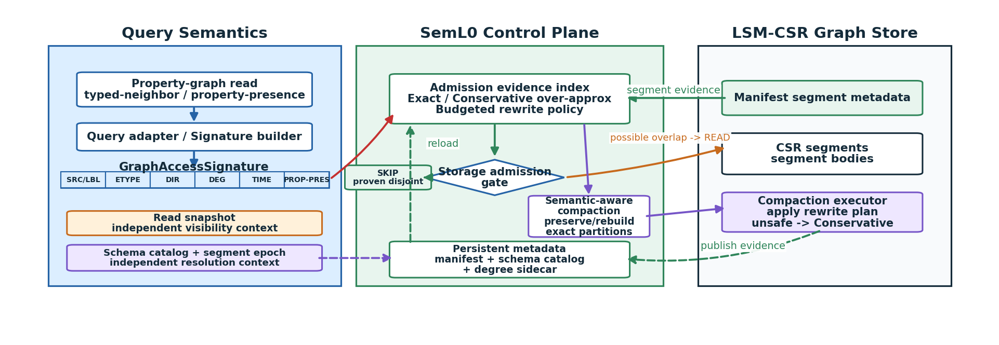
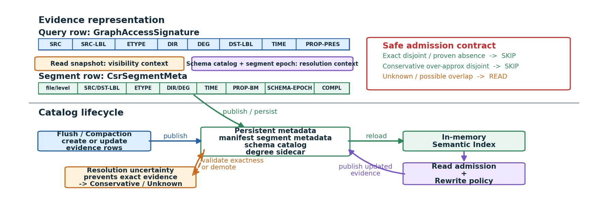
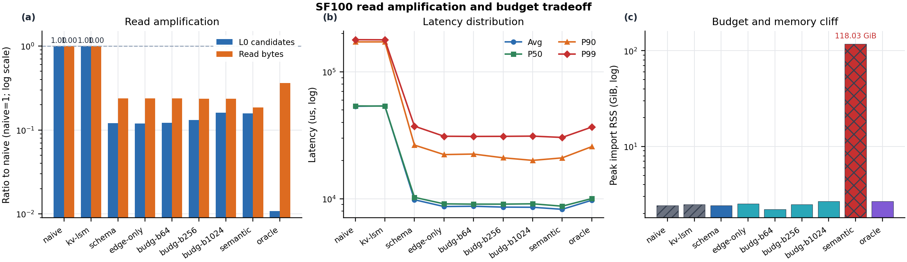
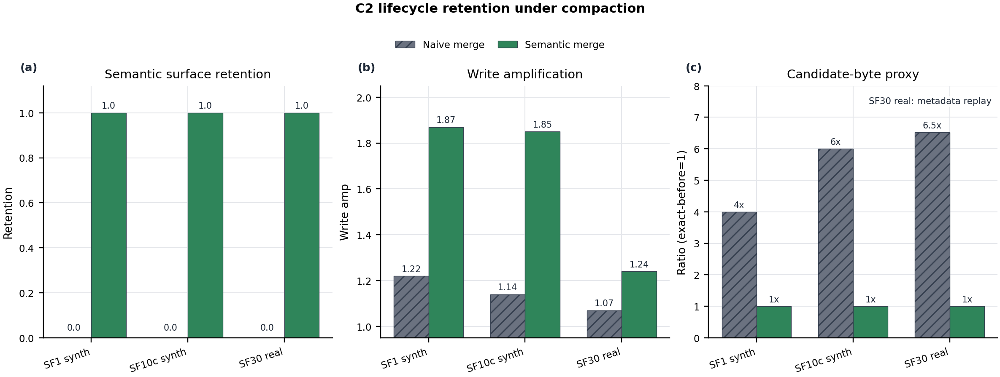
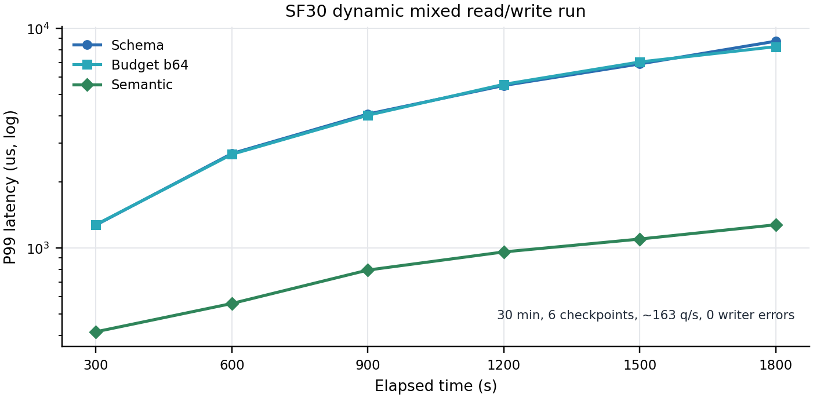
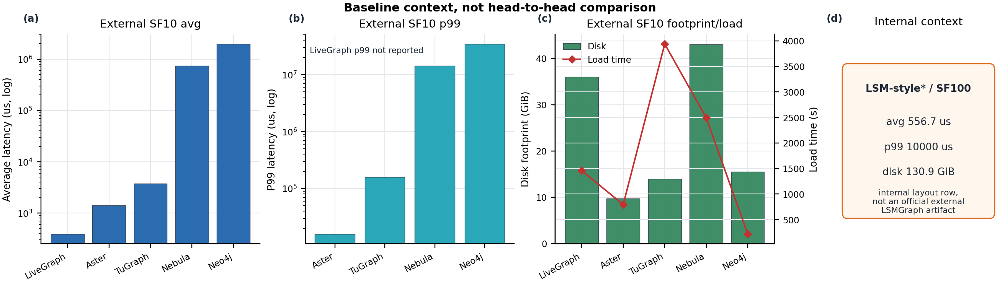

# SemL0 CIDR 中文阅读版

本文档对应英文主稿 `seml0-cidr-main-20260630.tex`，目标是解释真实代码和真实实验，不把概念图当成已经实现的功能。英文主稿受 CIDR 六页限制，只保留核心论点；这里补全术语、构建流程、segment（数据段）内部结构、公式、图表读法和证据边界。

## 1. 一页式动机和系统设计

传统 LSM-style storage（LSM 风格存储）主要围绕 key order（键顺序）、level structure（层级结构）和 segment files（数据段文件）组织读写。属性图查询却天然带有语义，例如 source label（起点标签）、edge type（边类型）、direction（方向）、degree class（度数类别）和 property-presence requirement（属性存在性要求）。查询明明只需要 `Person` 的 `KNOWS` 邻居，存储层如果不能证明某个 L0 segment 不含这类边，仍然必须把它列为 candidate segment（候选数据段），形成 read amplification（读放大）。

动态图适合 LSM：新边先进入 memgraph（内存增量图），随后 flush（刷写）成 immutable CSR segments（不可变 CSR 数据段），之后由 compaction（合并整理）重写到更低层。问题是 compaction 不是 semantic-neutral（语义中性的）。原来三个精确分区 `(Person, KNOWS)`、`(Person, LIKES_POST)`、`(Forum, HAS_MEMBER)` 如果被 naive merge（朴素合并）写成一个 `MIXED_EDGE_TYPE` segment，逻辑边一条没丢，但查询端失去了“这个文件肯定不含目标边”的证据。

SemL0 的核心做法是把 query semantics（查询语义）变成 storage admission evidence（存储准入证据）。查询侧构造 `GraphAccessSignature`（图访问签名），segment 侧持久化 `CsrSegmentMeta`（CSR 数据段元信息）。读路径比较两者，只在证据足以证明 disjoint（不相交）或 required property absent（所需属性确定不存在）时跳过文件。

这里有一个重要修正：当前真实 `GraphAccessSignature` **没有** `SNAP` 和 `EPOCH` 字段。snapshot（快照）是读 API 的独立参数，用于 MVCC visibility（多版本可见性）；schema epoch（模式纪元）由 `SchemaCatalog`（模式目录）和 `CsrSegmentMeta.schema_epoch` 处理，用于解释标签、边类型、属性和编码版本。签名中的 `min_ts/max_ts` 是可选的 record timestamp bounds（记录时间范围），不是 MVCC snapshot。

证据有三种 completeness（完整性）：

- `Exact`（精确）：摘要集合与 segment 真实集合相等。
- `Conservative`（保守过近似）：摘要可以多报，但不能漏报。只要这个过近似集合也与查询不相交，仍然可以安全跳过。
- `Unknown`（未知）：没有集合包含关系保证，不能提供语义剪枝证据，必须读。

`Mixed`（混合）不是第四种 completeness。它表示某个具体维度混在一起，例如 `MIXED_EDGE_TYPE` 或 `degree=Mixed`。一个 segment 可以同时是“topology exact（拓扑精确）但 degree mixed（度数混合）”，也可以是“edge type mixed 且 property summary unknown（属性摘要未知）”。

SemL0 不能把 label、edge type、degree、property、snapshot 和 schema epoch 的所有组合全部物化。full semantic（完整语义布局）会把所有 `(source label, edge type, degree class)` 组合都尝试分开，SF100 导入时达到 118.03 GiB peak RSS（峰值常驻内存）。因此 SemL0 使用 budgeted control（有预算的控制）：先保留 schema layout（模式级布局）的 label/edge-type 剪枝能力，再只把高分候选提升成 degree-exact partitions（度数精确分区）。

`budg-b64` 中的 64 不是“整个 SF100 只有 64 个 L0 文件”，也不是“每次 flush 多 64 个文件”。它是全局预算账本中，最多允许收费的 64 个 degree-exact L0 file units（度数精确 L0 文件计费单位）。未提升的 schema-style files（模式式文件）不计这笔预算，所以 SF100 的 `budg-b64` 实际有 3,483 个 L0 文件，SF10 有 444 个。

系统是 lifecycle-oriented design with stage-specific evidence（面向生命周期的设计，由各阶段分别验证）：W6 验证 flush layout、读准入和资源；C2 验证 compaction retention（合并后的语义面保留）和写放大；W7 验证 workload shift（工作负载变化）后反馈优先级会移动；W9 验证持续 flush 和 L0 accumulation（L0 累积），但该运行 `rewrite_bytes=0`，没有验证在线 compaction；W13 是有限的 schema/snapshot/tombstone correctness（模式、快照、墓碑正确性）测试。不能写成“一次端到端实验验证了完整生命周期”。

## 2. 真实 GraphAccessSignature 是什么

真实结构位于 [`src/semantic.rs`](../../../../src/semantic.rs)：

```rust
pub struct GraphAccessSignature {
    pub src: VertexId,
    pub src_label: i32,
    pub edge_type: Option<EdgeType>,
    pub direction: EdgeDirection,
    pub degree_class: Option<DegreeClass>,
    pub dst_label: Option<i32>,
    pub min_ts: Option<u64>,
    pub max_ts: Option<u64>,
    pub property_predicate: Option<PropertyPredicate>,
}
```

| 字段 | 中文解释 | 当前作用 |
|---|---|---|
| `src` | 起点顶点 ID | 指定真正要查的顶点；ID 里也编码了 label |
| `src_label` | 起点标签 | 例如 `Person=1`，用于和 segment 的起点标签比较 |
| `edge_type` | 边类型 | 例如 `KNOWS=1`，`None` 表示不限定类型 |
| `direction` | 方向 | `Out/In/Both/Unknown` |
| `degree_class` | 度数类别 | 可选的 Low/Medium/High admission hint（准入提示） |
| `dst_label` | 终点标签 | 可选，例如只要指向 `Post` 的边 |
| `min_ts/max_ts` | 记录时间范围 | 与 segment 的最小/最大记录时间比较，不是 snapshot |
| `property_predicate` | 属性存在性条件 | 当前只有 `RequiredPresent` 和 `AbsentOrDefault` |

### Person、KNOWS 和 property predicate 不是同一个概念

- `Person` 是 source label（起点标签）。
- `KNOWS` 是 edge type（边类型）。
- property predicate（属性谓词）在当前实现中应更准确地叫 property-presence requirement（属性存在性要求），例如“结果边必须带有 property id 2”。
- 当前签名不支持一般的 `weight = 3`、`age > 20` 或任意 `WHERE`。属性值相等查询走独立 prototype path（原型路径），没有扩展 `GraphAccessSignature`。

### 为什么 SNAP 和 EPOCH 必须在签名外

查询 API 是：

```rust
get_neighbors_by_signature(signature, snapshot)
```

`signature` 负责回答“哪些物理 segment 有可能包含目标语义”；`snapshot` 负责回答“segment 中哪些边版本在本次读取可见”。把两者合成一个字段会混淆 storage admission（存储准入）和 MVCC visibility（多版本可见性）。

schema epoch（模式纪元）是 `SchemaCatalog` 每次逻辑模式变化后的版本号。新增/删除/别名化 label 或 edge type、属性变化、属性编码变化都可能推进 epoch，不只是“把 KNOWS 改名成 FRIENDS”。segment 记录自己写入时的 `schema_epoch`，读取时由 catalog 解析旧 ID 和编码。它是 resolution context（解析上下文），不是本次访问本身的语义条件。

## 3. Exact、Conservative、Unknown 和 Mixed

### Exact 示例

segment 元信息明确写着：

```text
src_label = Person
edge_type_partition = KNOWS
summary_completeness = Exact
```

查询要 `Person + LIKES_POST`。两个 edge type 不相交，可以直接 `SKIP`。

### Conservative 示例

假设 segment 实际只有 `{KNOWS}`，保守摘要写成 `{KNOWS, LIKES_POST}`：

- 查询 `HAS_MEMBER`：摘要集合都不含它，安全 `SKIP`。
- 查询 `LIKES_POST`：摘要可能是假阳性，必须 `READ`。

所以 `Conservative` 不是“一律不能剪枝”，而是“只能用过近似集合证明不相交，不能用它证明一定存在”。

### Unknown 示例

旧 manifest 没有可靠语义字段，或完整性被标记为 `Unknown`。即使字段里碰巧出现某个 edge type，也不能把它当证明，必须保守读取。

### Mixed 示例

`MIXED_EDGE_TYPE` 表示一个 segment 内可能有多个边类型，因此 typed-neighbor query 不能按 edge type 跳过它。`degree=Mixed` 只表示低、中、高度数源点可能混在一起，不代表 label 和 edge type 也混了。

### tombstone absence 为什么要保守

property bitmap（属性存在位图）即使精确地不含 property 2，只要 `may_contain_tombstones=true`，当前实现仍保守读取，reason 是 `schema_tombstone_fallback`。这是因为删除标记、旧版本和 schema default（模式默认值）可能影响最终可见结果，单靠“当前物理值不出现”不能证明查询无答案。

## 4. segment 内部到底是什么样

一个 CSR segment 是一个物理文件，不是“一条 `(Person, KNOWS)`”。它主要包含：

```text
CsrSegmentMeta / header
  file_id, level, src_label, dst_label, edge_type_partition
  degree_class, degree_class_exact, schema_epoch
  min_src, max_src, min_ts, max_ts
  property_presence_bitmap, completeness, tombstone flag ...

offset array
  (src, first_edge_idx, edge_count)
  (Person A, 0, 3)
  (Person B, 3, 5)

edge bodies
  A -> X, KNOWS, ts=...
  A -> Y, KNOWS, ts=...
  A -> Z, KNOWS, ts=...
  B -> P, KNOWS, ts=...
  ...

optional property index/value section
```

同一个 `(Person, KNOWS)` 可以对应很多 segment，原因包括：

1. 不同 flush 会产生不同不可变文件。
2. 一个逻辑分区超过 64 MiB target 时，会按 source range（起点范围）切成多个文件。
3. compaction 的输入/输出层级不同。
4. 文件数上限或 policy（策略）可能合并、重建分区。

### 非 Mixed 的含义

`(Person, KNOWS, Low)` segment 的含义不是“只有一个 Person A”，而是：这个文件内可以有很多 `Person` 顶点，边类型都是 `KNOWS`，并且这些 source vertex（源顶点）在该分组里的邻居数都属于 Low。

例如：

```text
S_low = (Person, KNOWS, Low)
  Person A: 3 条 KNOWS
  Person B: 8 条 KNOWS
  Person C: 16 条 KNOWS
```

A、B、C 会进入同一个 Low logical partition（低度数逻辑分区），只要物理大小允许就可以进入同一个 file。它们不是因为“Person 不一样”就分开，因为 `Person` 是标签，不是某一个人的 ID。offset array 仍然保留每个具体 source 的邻接边界。

### degree Mixed 的具体例子

```text
S_mixed = (Person, KNOWS, Mixed)
  Person A: 3 条 KNOWS       -> Low
  Person B: 40 条 KNOWS      -> Medium
  Person C: 2,000 条 KNOWS   -> High
```

这里 label 和 edge type 仍然可以是精确的 `Person + KNOWS`，只是 degree dimension（度数维度）混了。查询仍可按 label/edge type 剪枝，但不能仅凭 degree class 跳过该文件。

### Low=1-16 是否一定合并成一个文件

不是。被选中候选中的 Low source 会先进入同一个逻辑 Low 分区，但最终还受以下条件影响：

- per-class benefit gate（每类收益门槛）是否允许 Low 保持 exact；
- 64 MiB target segment size（目标文件大小）；
- source range split（源点范围切分）；
- 每次 flush 的 segment cap（文件数上限）。

因此“同类就进入同一个逻辑桶”不等于“全局永远只有一个物理文件”。

## 5. budg-b64 的完整构建流程



### 第一步：候选是什么

输入先按 `(source_label, edge_type, src, dst, ts)` 排序，再以 `(source label, edge type)` 分组。一个候选例如：

```text
g = (Person, LikesPost)
```

它包含本次 flush 中所有起点标签为 Person、边类型为 LikesPost 的边。

### 第二步：group_bytes 和 cost

代码中的：

```text
group_bytes = group 中 EdgeRecord 数量 * sizeof(EdgeRecord)
cost = estimated_exact_files
     = max(ceil(group_bytes / target_segment_bytes), 1)
target_segment_bytes = 64 MiB
```

`group_bytes` 是用内存中逻辑 `EdgeRecord` 大小估算的数据量，不是最终 `du` 出来的完整磁盘文件大小。`cost` 是“如果把这个候选提升为 degree-exact 语义分区，预计要收费多少个目标大小文件”。

必须注意：`cost=10` **不是**“严格比 schema 物理布局净增加 10 个文件”。代码把未提升的 schema-style base 当成零预算成本，只对被提升候选的 `estimated_exact_files` 收费。因此它是 semantic promotion accounting（语义提升计费），不是 `exact_file_count - original_file_count` 的精确差值。

### 第三步：query_weight 从哪里来

静态 configured weight（配置权重）：

```text
core edge type:          4.0
reverse core edge type:  2.0
other edge type:         0.5
```

W6 的核心 edge types 来自真实 [`src/types.rs`](../../../../src/types.rs)：

| ID | EdgeLabel | 中文含义 |
|---:|---|---|
| 1 | `Knows` | 人认识人 |
| 2 | `HasCreator` | 帖子/评论由某人创建 |
| 3 | `HasTag` | 消息/论坛带有标签 |
| 7 | `LikesComment` | 人点赞评论 |
| 8 | `LikesPost` | 人点赞帖子 |
| 9 | `ReplyOfComment` | 评论回复评论 |
| 10 | `ReplyOfPost` | 评论回复帖子 |
| 11 | `ContainerOf` | 论坛包含帖子 |
| 12 | `HasMember` | 论坛拥有成员 |

W6 的 `EDGE_TYPES=1,2,3,7,8,9,10,11,12` 只跑正向类型。代码把相应负数类型视为 reverse core edge type（反向核心类型），给 2.0。

反馈权重来自运行时 `L0PartitionSnapshot`：

```text
candidate_pressure = max(avg_candidate_segments, 1)
range_feedback = min(query_count * candidate_pressure, 1,000,000)
feedback_weight(source_label, edge_type)
  = 同一组各 range_feedback 之和

query_weight = max(configured_weight, feedback_weight)
```

`query_count` 是该范围真正被查询的次数；`avg_candidate_segments` 是这些查询平均面对多少 candidate segments。它们相乘近似表示“这个分区既热，而且当前读放大压力大”。W6 静态导入主要体现 configured weight；W7 专门验证 feedback（反馈）在 workload shift 后会改变 hot partition（热点分区）的选择。

### 第四步：score

```text
score = query_weight * (group_bytes / 1024) / estimated_exact_files
```

可以理解为：

```text
重要性 * 数据规模 / 文件预算成本
```

它是 ranking heuristic（排序启发式），不是预测延迟的物理模型。除以文件成本，是为了避免一个很热但会消耗大量文件的候选无条件占满预算；乘数据量，是因为很小的组即使热门，绝对可避免字节也有限。

### 第五步：used + cost <= 64

- `used`：当前 store 已经在这本预算账上收费的 degree-exact L0 file units。重开 store 时，代码会重新数已有的 `degree_class_exact=true` 文件恢复账本。
- `cost`：当前候选的 `estimated_exact_files`，至少为 1。
- `B=64`：允许的最大收费总额。

候选按 score 降序。若：

```text
used + cost <= 64
```

则提升候选并执行 `used += cost`；否则 reason 写为 `fanout_budget_exhausted`，退回 schema-style degree Mixed。score 相同时，代码继续按 group edge count、source label、edge type 做确定性排序。

### 第六步：选中后为什么还要按 degree class 细分

score 解决的是“哪个 `(source label, edge type)` 值得花文件预算”。degree class 解决的是“同一个语义组内，低/中/高度数 source 是否值得分开放”。两者层次不同。

每个具体 source 的 degree 是该 source 在候选组中的边数：

```text
Low:     1-16
Medium:  17-1024
High:    >1024
Unknown: 0 或无可信统计
Mixed:   policy 没有物化成单一类别
```

阈值是当前原型中的固定工程配置，位于 `DegreeClass::from_max_degree`，不是从 SF100 自动学习出来的。选中的候选还要经过二级 degree benefit gate：

```text
degree_score =
  (class_bytes / min_exact_bytes)
  * competing_query_fraction
  * class_weight
  * degree_weight

class_weight: Low=1.0, Medium=1.25, High=2.0
default min_exact_bytes=4 MiB
default min_benefit_score=1.0
```

通过才写成 exact Low/Medium/High；没通过仍并入 Mixed。因此“候选被 score 选中”不代表它的三个 degree class 必然全部产生独立文件。

### 第七步：查询如何使用这些 segment

查询不会因为 metadata “看起来不像”就跳过。真实规则是：

```text
Exact disjoint / proven absence          -> SKIP
Conservative over-approx also disjoint   -> SKIP
Unknown / Mixed / possible overlap       -> READ
```

## 6. 各 variant（实验变体）是什么意思

| variant | 真实含义 | 比对目的 |
|---|---|---|
| `naive` | 每次 flush 不主动按图语义分区 | 语义盲锚点 |
| `kv-lsm` | RocksDB-style KV-LSM 模拟基线：按 key/range 切文件，但语义 metadata 全是 Unknown/Mixed | 区分“有 LSM key order”和“有可用图语义证据”；不是在运行真正 RocksDB |
| `schema` | 主要按 `(source label, edge type)`；degree 固定为 Mixed，小于 4 MiB 的 edge-type 小组可能按 source label 合成 mixed edge type | 强静态基线 |
| `edge-only` | 只按 edge type；source/destination label 和 degree 粗化 | 看 edge type 单维证据贡献 |
| `budg-b64` | schema base 加最多 64 个收费的 degree-exact 文件单位 | 主 budget 工作点 |
| `budg-b256/b1024` | 同一算法，更大文件预算 | 画预算趋势 |
| `semantic` | 不受 `used+cost<=B` 限制，所有 `(source label, edge type)` 都进入 degree class 分割流程 | full semantic 资源上界/压力点 |
| `oracle` | 构建精确的内存 L0 index 作为 pruning upper bound（剪枝上界），不代表可部署物理布局 | 参考上界，不能当生产系统 |

为什么要同时比较 schema 和 b64：schema 已经是很强的静态布局，b64 的价值不是保证每项指标都更快，而是给 degree precision（度数精度）一个资源上限，并允许反馈把精度移向当前热点。SF100 中 b64 candidates 略高于 schema，延迟 gate 是 `FALLBACK`；这必须诚实保留。

## 7. Figure 1：SemL0 control plane 详解



### 左列 Query Semantics（查询语义）

从上到下：

1. `Property-graph read`：typed-neighbor 或 property-presence 查询。
2. `Query adapter / Signature builder`：把查询 API 参数整理成存储可见签名。
3. `GraphAccessSignature` 行：`SRC/LBL | ETYPE | DIR | DEG | TIME | PROP-PRES`。
4. `Read snapshot`：独立可见性上下文，不在签名行。
5. `Schema catalog + segment epoch`：独立解析上下文，不在签名行。

签名行每一格：

- `SRC/LBL`：具体 source 与 source label。
- `ETYPE`：边类型。
- `DIR`：方向。
- `DEG`：可选度数类别。
- `TIME`：记录时间范围。
- `PROP-PRES`：属性存在性要求。

### 中列 SemL0 Control Plane（SemL0 控制面）

- `Admission evidence index`：内存中可查的 segment 语义摘要。
- `Storage admission gate`：执行安全跳过规则。
- `SKIP proven disjoint`：只有可证明不相交才跳过。
- `possible overlap -> READ`：可能相交就读 body。
- `Semantic-aware compaction`：合并时保留或重建 exact partition。
- `Persistent metadata`：实际是 manifest、schema catalog、degree sidecar，不是一个虚构的单一“大目录”。

### 右列 LSM-CSR Graph Store（LSM-CSR 图存储）

- `Manifest segment metadata`：每个文件的元信息。
- `CSR segments / segment bodies`：offset array 和 edge body 的真实数据。
- `Compaction executor`：执行 rewrite plan；无法安全保持 exact 时降级为 Conservative/Unknown，而不是伪装成 exact。

红色路径表示 query signature 驱动准入；绿色表示 metadata 发布、重载和 skip；橙色表示真正读取 body；紫色表示 compaction rewrite path。

## 8. 详细 evidence 图：每一行每一列



这张图从英文主文移到中文阅读版和 artifact，因为 Figure 1 已经吸收核心契约。

### Query row: GraphAccessSignature

| 列 | 含义 |
|---|---|
| `SRC` | 具体起点 ID |
| `SRC-LBL` | 起点标签 |
| `ETYPE` | 边类型 |
| `DIR` | 方向 |
| `DEG` | 度数类别 |
| `DST-LBL` | 终点标签 |
| `TIME` | 记录时间区间 |
| `PROP-PRES` | 属性存在条件 |

两个外部框明确说明 snapshot 和 schema/epoch 不属于签名本身。

### Segment row: CsrSegmentMeta

| 列 | 含义 |
|---|---|
| `file/level` | file ID 与 LSM level |
| `SRC/DST-LBL` | 可能包含的起点/终点标签 |
| `ETYPE` | 精确 edge type 或 `MIXED_EDGE_TYPE` |
| `DIR/DEG` | 方向与度数摘要 |
| `TIME` | segment 内记录时间范围 |
| `PROP-BM` | property presence bitmap |
| `SCHEMA-EPOCH` | 写入该 segment 时的模式纪元 |
| `COMPL` | Exact/Conservative/Unknown 完整性 |

右上角是安全规则；下半部分表示 flush/compaction 写 metadata，manifest/catalog/sidecar 持久化，重开后构建 in-memory semantic index，再供 read admission 和 rewrite policy 使用。

## 9. SF100 budget/resource 图详解



横轴每一项都是上一节的 variant。三个 panel 使用同一组变体。

### (a) Read amplification（读放大）

- 蓝柱：`candidate L0 segments`，即所有查询累计通过 L0 准入第一层的 segment 数。
- 橙柱：`read bytes`，读取指标的累计字节数。
- y 轴：`variant_metric / naive_metric`，naive 固定为 1；log scale（对数坐标）。0.1 表示 naive 的 10%。
- 这不是把候选数和字节直接相加，它们分别归一化后并排显示。

candidate L0 是主指标。read bytes 是次要指标，因为 metadata cache miss（元数据缓存未命中）时，reader 会重复读取较大的 offset array，造成 offset-array/cache over-read（偏移数组/缓存过读）；SF100 read bytes 标准差很大。

### (b) Latency distribution（延迟分布）

- y 轴：microseconds（微秒），对数坐标。
- 四条线：Avg、P50、P90、P99。
- 表里的 percentile 是“每个 edge type 的 percentile 再跨 repeat 求均值”，不是所有操作混在一起的全局 percentile。

SF100 `budg-b64` 的平均延迟是 8,722.1 us，schema 是 9,816.8 us，但 schema 标准差很大，1-stddev 区间重叠，所以正式 gate 是 `FALLBACK`。可以说“本 workload 的测量值较低”，不能说“稳定显著领先”。

### (c) Budget and memory cliff（预算和内存悬崖）

- y 轴：peak import RSS（导入峰值常驻内存），GiB，对数坐标。
- semantic 的红色柱达到 118.03 GiB。
- `budg-b64` 为 2.21 GiB，证明预算限制了语义物化的资源风险。

### SF10/SF100 关键资源数据

| scale | variant | store GiB | L0 files | peak RSS GiB |
|---|---|---:|---:|---:|
| SF10 | schema | 13.3 | 376 | 2.12 |
| SF10 | budg-b64 | 13.3 | 444 | 2.26 |
| SF10 | semantic | 14.6 | 737 | 8.38 |
| SF100 | schema | 133.9 | 3,444 | 2.42 |
| SF100 | budg-b64 | 133.9 | 3,483 | 2.21 |
| SF100 | semantic | 146.4 | 6,615 | 118.03 |

## 10. C2 compaction 图详解



### 为什么使用 synthetic（合成受控数据）

C2 要证明的是 merge policy（合并策略）对 semantic pruning surface（语义剪枝面）的因果影响，而不是端到端数据库性能。受控输入先构造 N 个 exact `(source label, edge type)` partitions，让 naive 和 semantic 两种策略吃完全相同的逻辑边：

- naive merge 把 N 个 exact 分区合成 mixed output；
- semantic merge 保留 N 个 exact outputs。

这样唯一主动变化的是 merge policy。SF1 synth 使用 4 个 edge types、1,200 条边；SF10c synth 使用 6 个 edge types、240,000 条边。`SF10c` 是 SF10-class controlled（SF10 级别的受控数据），不是 LDBC SF10 全量数据。

真实 SF30 再补 external validity（外部有效性）：retention/write 实验确实处理完整的 1,087,848,423 条有向边；read consequence 则只对全部 40 个真实 observed partitions（观测到的分区）做 metadata replay，没有执行完整 body decode。

### (a) Semantic surface retention

先定义：

```text
exact_surface_ratio_before =
  合并前落在 topology-exact segments 中的边数
  / 本次 merge 覆盖的总边数

exact_surface_ratio_after =
  合并后落在 topology-exact segments 中的边数
  / 合并输出总边数

retention =
  exact_surface_ratio_after / exact_surface_ratio_before
```

`exact semantic segment 里的边数` 指 metadata 的 `(src_label, edge_type)` 都是具体值并允许安全拓扑剪枝的 segment 中所含 edge_count 总和。它不是“正确答案边数”，而是“仍携带精确拓扑身份的物理边数”。

图中所有输入 before 都是 1.0。naive after 为 0，所以 retention=0；semantic after 为 1，所以 retention=1。

如果输出是：

```text
S1' = (Person, KNOWS)          100 edges
S2' = (Person, LIKES_POST)     100 edges
S3' = (Person, MIXED)          200 edges
```

则 exact edges=200，总边数=400，`exact_surface_ratio_after=0.5`。若 before=1.0，retention 也是 0.5。

### (b) Write amplification

```text
write_amp = output_bytes / logical_update_bytes
```

- `logical_update_bytes`：本次 compaction 所覆盖逻辑 edge records 的基准 payload 大小，不重复计算每个物理 header/bloom/offset。
- `output_bytes`：真正写出的 segment 文件字节，包括 headers、offset arrays、bloom、padding 等物理开销。

semantic merge 输出更多独立 exact segments，每个文件都有固定开销，所以 controlled rows 是 1.87/1.85，高于 naive 的 1.22/1.14。真实 SF30 是 1.24 对 1.07，说明代价存在但在该数据上较小，不能写成 zero overhead（零开销）。

### (c) Candidate-byte proxy

对 merge 前实际存在的每个 `(source label, edge type)` 分区构造一个签名。SF30 一共 40 个，这个 40 来自 `collect_exact_partition_stats` 枚举真实分区，不是随机挑 40 个。

对每个查询分区：

```text
candidate_bytes_after =
  遍历 post-merge segment metadata
  把 signature_pruning_decision 判定为 READ 的 segment_bytes 相加

exact_partition_bytes_before =
  merge 前属于该 exact (source label, edge type) 分区的 segment_bytes 总和
```

最终：

```text
weighted candidate-byte proxy =
  sum(candidate_bytes_after over 40 partitions)
  / sum(exact_partition_bytes_before over 40 partitions)
```

结果：

- naive：282.16 GB / 43.25 GB = 6.52x；平均 93.6 candidate segments/query。
- semantic：43.25 GB / 43.25 GB = 1.00x；平均 13.2 candidate segments/query。

`post-merge segment metadata 判断` 就是调用每个输出 segment 的 `signature_pruning_decision`，检查 label、edge type、direction、degree、property 和 completeness 是否能证明跳过。它没有打开并解码全部 edge body，所以 6.52x 是 candidate-byte proxy，不是 6.52x 端到端 latency speedup。

## 11. W9 dynamic 图应该怎么理解



- x 轴：elapsed time（运行经过时间），300 到 1,800 秒，共 6 个 checkpoint。
- y 轴：每个 checkpoint 的 p99 latency，微秒，对数坐标。
- 三条线：schema、budget b64、semantic。

时间越久，持续写入产生更多 flush 和 L0 files，所以三种布局的候选数和 p99 都上升。这不表示 metadata “失效”或结果不正确；它表示相同语义证据面对越来越多物理文件，read path 仍会退化。

该运行中三种 variant 的 `rewrite_bytes` 都是 0。也就是说，它测到了持续 flush 和 L0 accumulation，没有在运行过程中发生 compaction rewrite。因此这张图不能证明 semantic-aware compaction 在动态运行中保留了 pruning surface，已从英文主文移出，只保留为 artifact evidence（工件证据）。

## 12. 外部 baseline 图为什么不用于速度排名



- (a)：外部系统 SF10 平均延迟，对数坐标。
- (b)：外部系统 SF10 p99，对数坐标；LiveGraph 没有可比 p99。
- (c)：disk footprint（磁盘占用）柱和 load time（导入时间）线。
- (d)：内部 LSM-style SF100 context，不是官方 LSMGraph artifact。

LiveGraph、Aster、TuGraph、NebulaGraph、Neo4j 都通过 count/hash digest gate，但各自 query driver、操作次数、loader 和 scope 不完全相同。W6 SemL0 是 9,000 或 45,000 次 core-edge 查询，外部系统可能是 850、1,700 或 32,140 次其他 scope。因此这张图只能说明“我们真实跑通了可比 typed-neighbor interface”，不能形成系统速度排名。英文主稿把它缩成一段 artifact statement。

## 13. 证据类型和论文主张边界

| 类型 | 对应实验 | 可以说明什么 | 不能说明什么 |
|---|---|---|---|
| measured（实测） | W6 SF10/SF100 | candidates、latency、store、L0 files、RSS 的真实运行值 | 不能忽略 SF100 latency gate 和 read-byte variance |
| controlled（受控实验） | C2 SF1/SF10c synth | merge policy 对 retention/read consequence 的因果关系 | 不是全量 LDBC 端到端性能 |
| measured real open-mode | C2 SF30 | 全量 1.09B 边上的 retention 和 write amp | 没有执行全量 body-read latency |
| proxy（代理指标） | C2 SF30 metadata replay | post-merge metadata 导致的候选字节后果 | 不是实际 I/O 字节或端到端加速比 |
| derived workload（派生负载） | W7 | feedback 会随热点变化移动优先级 | 不是生产 trace |
| measured accumulation | W9 | 30 分钟持续 flush/L0 累积趋势 | `rewrite_bytes=0`，未验证在线 compaction |
| bounded-test（有限测试） | W13 | 当前 fixed-width encoding、epoch、alias/drop、snapshot/tombstone fallback 正确 | 不是通用 schema migration 引擎 |

## 14. 代码和 artifact 对照路径

### 核心代码

- [`src/semantic.rs`](../../../../src/semantic.rs)：`GraphAccessSignature`、`DegreeClass`、property-presence predicate。
- [`src/csr/format.rs`](../../../../src/csr/format.rs)：`CsrSegmentMeta`、安全剪枝、semantic surface 统计。
- [`src/schema.rs`](../../../../src/schema.rs)：`SchemaCatalog`、schema epoch、Exact/Conservative/Unknown。
- [`src/graph.rs`](../../../../src/graph.rs)：各 layout、budget score、`used+cost`、degree-class 二级 gate、semantic compaction。
- [`src/types.rs`](../../../../src/types.rs)：VertexLabel/EdgeLabel 数字映射。
- [`src/bin/c2_merge_retention.rs`](../../../../src/bin/c2_merge_retention.rs)：C2 retention、write amp、candidate-byte proxy 公式。

### 主实验汇总

- [`baseline/sf100-matrix-20260613-cn.md`](../../../sf100-matrix-20260613-cn.md)：W6 SF100 DONE。
- [`baseline/w6-sf10-priority-20260709-summary.md`](../../../w6-sf10-priority-20260709-summary.md)：W6 SF10 DONE。
- [`baseline/w7-sf30-workload-shift-summary-20260615-cn.md`](../../../w7-sf30-workload-shift-summary-20260615-cn.md)：W7 workload shift。
- [`baseline/w9-steady-state-summary-20260615-cn.md`](../../../w9-steady-state-summary-20260615-cn.md)：W9 30 分钟动态运行。
- [`baseline/w13-schema-evolution-summary-20260614.md`](../../../w13-schema-evolution-summary-20260614.md)：W13 十项有限正确性测试。
- [`baseline/path-b-c2/stage5-scale-summary-20260618-cn.md`](../../../path-b-c2/stage5-scale-summary-20260618-cn.md)：C2 controlled rows。
- [`baseline/path-b-c2/stage5-sf30-real-summary-20260619-cn.md`](../../../path-b-c2/stage5-sf30-real-summary-20260619-cn.md)：C2 SF30 retention/write。
- [`baseline/path-b-c2/stage7-sf30-readamp-proxy-summary-20260622-cn.md`](../../../path-b-c2/stage7-sf30-readamp-proxy-summary-20260622-cn.md)：C2 SF30 metadata replay。

### 论文和图

- [`cidr/tex/seml0-cidr-main-20260630.tex`](../tex/seml0-cidr-main-20260630.tex)：英文 canonical 主稿。
- [`cidr/scripts/plot_cidr_figures.py`](../scripts/plot_cidr_figures.py)：只负责依次调用 standalone generators 的总入口。
- [`cidr/images`](../images)：同源生成的 PDF/SVG/PNG。

## 15. 最简总结

SemL0 不是“语义越细越好”。它的完整主张是：查询语义先被压成存储可验证的 admission signature；segment metadata 只有在 Exact 或安全 Conservative 证据能证明无关时才允许跳过；compaction 必须保留或明确降级这份证据；degree-exact 物化由 score 和文件预算控制。`budg-b64` 的价值是把 full semantic 的不可控资源风险变成有上界的语义提升，并允许反馈把有限预算移向热点，而不是保证它在每个 workload、每个指标上都胜过 schema。
