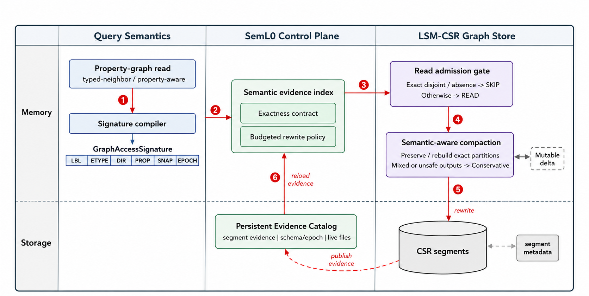
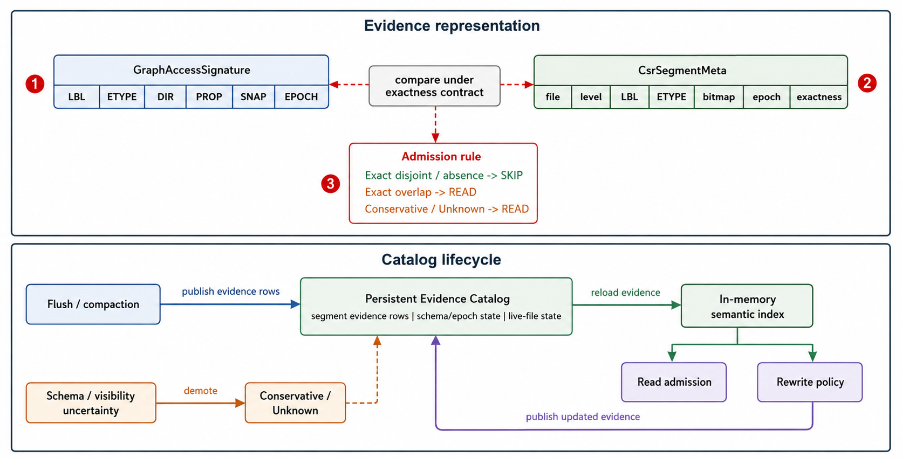
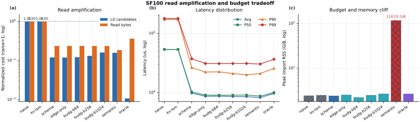
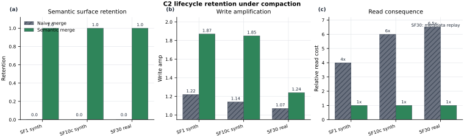
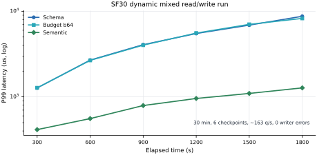

# SemL0：把查询签名作为动态图存储的控制平面

## 摘要

动态属性图存储天然暴露丰富的查询签名：点标签、边类型、方向、度数类别、属性谓词、snapshot 和 schema epoch。现有许多 LSM-style 图存储把这些语义停留在查询层；存储层仍然围绕 key、level、adjacency block 和 size-based compaction 组织读路径和物理重写。这个分离会造成不必要的选择性读放大：查询已经能识别自己需要的 typed neighborhood，但存储层仍然会探测语义无关的 segment。

SemL0 是一个 LSM-based property-graph store 原型。它把查询签名作为存储控制平面：在 flush 时生成 segment-level semantic state，在读路径上只用 exact evidence 做安全剪枝，在 compaction 中保留或重建 semantic pruning surface，并在 schema、snapshot、tombstone 不确定时保守回退。SemL0 要验证的不是“完整图数据库”，而是一个系统架构原则：mutable graph storage 不应该只受 key order 和 level structure 控制，也应该受它要服务的 graph query semantics 控制。

在 LDBC SNB up to SF100 的原型实验中，SemL0 降低 candidate segments 和 read bytes；同一组实验也暴露出 unbudgeted semantic materialization 的 118.03 GiB memory cliff。真实 SF30 compaction input 上，semantic-aware compaction 保留 pruning surface；schema/snapshot 测试覆盖 no-false-negative fallback 路径。外部比较只作为 typed-neighbor interface 的 digest-gated positioning evidence，不宣称完整图数据库 head-to-head。

## 1. Introduction

属性图查询是语义化的。一个典型查询不是简单寻找下一个 key range 或 adjacency block，而是访问某类 typed neighborhood：从 `Person` 出发的 `KNOWS` 边、和 `Forum` 有关的 membership 边、满足属性谓词的 message 边，或者某个 snapshot 下可见的路径。这些查询携带 source label、edge type、direction、degree class、property access pattern、temporal visibility 和 schema epoch。

这个接口已经不是某一个 graph database product 的局部特性。图查询语言工作正在把 property graph 收敛成一个共同模型：Cypher 给出了实际工业语言，G-CORE 抽象出可组合的研究核心，SQL/PGQ 把 property-graph pattern matching 带进 SQL，GQL 则把 property-graph query language 标准化 [14,20,21,22,23]。这个趋势对 storage 很重要。Labels、edge types、properties、paths、snapshots 不是偶然语法，而是应用反复用来导航图数据的共同词汇。LDBC SNB 这类 benchmark 也体现了同一点：typed neighborhoods、properties 和持续变化的 social objects 是 workload 的核心 [3]。

存储系统通常没有跟上这个 semantic interface。LSM-style graph store 对动态图很有吸引力：更新先进入 mutable 或 append-friendly component，之后通过 flush 和 compaction 进入 immutable segments。但存储层通常围绕 key order、level structure、adjacency representation 和 size-based rewrite policy 工作。结果是 query semantics 在上层解释，storage 本身仍然 largely query-blind。

这个错位会产生一种特定的 read amplification。一个选择性 property-graph query 可能知道只有很少一部分 typed neighborhoods 会贡献结果，但如果 segment metadata 不能证明某个 segment 语义无关，read path 仍然必须检查它。在 LSM layout 中这个问题更明显：L0 中原本语义精确的 segments 经过 compaction 进入 lower levels 后，可能变成 mixed physical outputs。一旦 segment 失去精确语义身份，未来查询就只能保守读取它，即使其中大部分内容无关。

SemL0 采用的做法是把 query signatures 下沉为 storage-level control plane。在这个架构里，property-graph query semantics 会被编译成 storage-visible metadata 和 rewrite decisions。Segment metadata 记录一个 segment 可能包含哪些 graph neighborhoods。Read path 只有在 absence 或 disjointness 是 exact 的情况下才剪枝。Compaction path 保留或重建高价值 semantic partitions，而不是把物理重写当成语义中立操作。Schema changes、tombstones、snapshot uncertainty 下，correctness path 保守回退。

SemL0 是这个架构的原型。它把图数据存成带 semantic state 的 LSM-style CSR segments。Query signature 描述图访问模式，包括 labels、edge types、direction、degree class、properties 和 visibility constraints。Flush 产生 segment-level semantic summaries。Query time 使用 exactness-aware pruning contract：只有当 segment semantic state 证明它不可能贡献结果时，才能跳过。Compaction time 把物理重写当作保留 semantic pruning surface 的机会。不确定时，SemL0 牺牲剪枝而不是牺牲正确性。

由此得到的关键约束是：compaction 不能被当成 semantically neutral 的后台任务。传统 LSM compaction 通常从 level size、key overlap、space amplification、write amplification 讨论。但在 property-graph store 中，compaction 也会改变读路径的 semantic shape。Naive merge 可以把原本 exact 的 semantic partitions 合成 mixed outputs，从而破坏未来安全剪枝所需的 evidence。Semantic-aware merge 则可以在有界 rewrite cost 下保留或重建 exact partitions。

贡献如下：

1. 提出 dynamic property graph 的 storage-level query-semantic control plane。
2. 定义 Exact / Conservative / Unknown 的 exactness-aware pruning contract。
3. 把 semantic surface retention 明确为 physical rewrite problem。
4. 给出 LDBC SNB 和 digest-gated baselines 上的原型证据，同时明确比较边界。

## 2. Motivation

LSM-style storage 适合动态图更新。写入可以先进内存或 append-friendly component，再 flush 成 immutable segments，之后由后台 compaction 重组。这种设计在 key-value stores 中已经成熟 [1,2]，也影响了 LSMGraph、BACH、TuGraph 这类动态图/图数据库存储设计 [9,10,11]。但 property graph 中的 read amplification 不只是 key overlap 或 file count 的问题，也是 semantic invisibility 的问题。

考虑 LDBC-style social graph 上的 typed-neighbor query [3]。一个 query 需要 `Person` 的 outgoing `KNOWS` 边；另一个 query 需要与 `Forum` 有关的 `HAS_MEMBER` 边。在 query layer，这两个访问语义完全不同。但如果 storage layer 只看 physical segments 和 key ranges，它们可能都要探测很多 L0 files，因为系统不能证明某个文件没有相关边。这是一个 admission problem：在读 segment body 之前，storage layer 缺少拒绝语义无关 segment 的 proof。

现有动态图系统提供了重要参照。LiveGraph 关注 transactional graph storage 和高效 adjacency scans [4]；Teseo、GraphOne 关注 structural dynamic graphs 和 real-time analytics [5,6]；LLAMA、Aspen 以及 recent DGS study 探索 multi-version、streaming 或 in-memory dynamic graph representations [7,8,15]；Aster 使用 LSM-oriented storage ideas 支持图数据库 [12]；NebulaGraph 研究 distributed native graph database architecture [13]。这些系统不是广义上的 query-blind，它们各自围绕特定接口和更新模型设计。SemL0 关注的问题更窄：一个 LSM-style property-graph storage layer 如何利用 typed-neighbor 和 property-aware queries 中已有的语义，来控制 pruning 和 physical rewrite？

第一个约束是安全。Semantic pruning 很诱人，因为 labels、edge types、properties、snapshots、schema epochs 都是强过滤条件。但 storage engine 不能因为一个 segment “可能无关”就跳过它。Segment 可能在旧 schema epoch 下写入，可能包含影响 snapshot visibility 的 tombstones，也可能经过 compaction 后混合了多个 semantic categories。如果 metadata 不是 exact，剪枝就可能静默漏答案。因此 query semantics 只有在每次 skip 都是 proof obligation 的前提下，才能成为 storage control signal。

第二个约束是生命周期。只给 freshly flushed segments 加 semantic metadata 不够。LSM tree 会反复 rewrite segments。Flush policy 可能创建 exact semantic partitions，但 later compaction 可能把它们合成 mixed output。图内容仍然正确，但未来剪枝需要的 evidence 没了。因此问题不只是 query signatures 能不能过滤 L0，而是 mutable graph store 能不能跨 flush、read、compaction、schema evolution、tombstones 和 snapshots 保留有用的 query-semantic evidence。

研究问题是：

> Can property-graph query signatures serve as a safe, budgeted storage control plane for mutable LSM graph stores?

## 3. System Design

图1把 SemL0 画成 query-semantic control plane，而不是另一个 graph storage engine。Property-graph read 先被编译成 storage-visible signature；control plane 把这个 signature 和 segment-level evidence 比较，并用 exactness contract 决定 read admission。只有 exact evidence 能证明 disjointness 或 absence 时，segment 才能被 skip；否则就读。相同的 evidence 也进入 semantic-aware compaction，让 physical rewrite 保留或重建 pruning surface，而不是静默破坏它。底部的 Persistent Evidence Catalog 表示 evidence 会跨 flush、compaction、restart 和 future reads 保留下来。底层存储仍然属于 write-friendly delta 和 CSR-like read path 这一类设计背景 [9,10]；SemL0 的差异在于把 query-semantic evidence 持久化为 read 和 compaction 都能使用的控制信号。图右侧的 read admission gate 和 semantic-aware compaction 是由 SemL0 控制的 store-side decision hooks，不是底层 store 自己独立决定的普通策略。

SemL0 把一个 graph access 中对 storage 可见的部分表示为 query signature。Signature 不是完整 logical query plan，而是那些会影响 storage decisions 的 query semantics 子集。当前原型主要覆盖 LDBC SNB-style 数据上的 typed-neighbor 和 property-aware reads。Signature 可以包含 source label、edge type、direction、degree class、property predicate class、snapshot 和 schema epoch。Signature 可以是 partial 的；当某个组件 unknown、unsupported，或者在当前 schema/snapshot 下不安全时，SemL0 会保守携带它，而不是把不确定性转成 pruning evidence。

每个 segment 保存 compact semantic state，描述它可能包含什么，以及这个 summary 有多可信。一个 segment 可以 exact for 某个 `(source label, edge type)`，也可以只对 edge type exact，或者因为混合多个 labels/epochs 而 Conservative，或者因为 schema/visibility 信息不足而 Unknown。真正有用的不只是 metadata format，而是 exactness state：Exact evidence 可以相对于 query signature 证明 absence 或 disjointness；Conservative/Unknown evidence 不能。因此 SemL0 把 exact segment metadata 当作 read admission 的 proof object，而不是 best-effort cache hint。

图2展开了 control plane 背后的 evidence representation。SemL0 把 query-side access pattern 和 storage-side segment summary 都表示成可比较的 evidence rows：`GraphAccessSignature` 描述 query 对 storage 可见的语义，`CsrSegmentMeta` 描述 segment 能提供的 semantic evidence。两者共享 label、edge type、epoch 等维度，因此 exactness contract 可以判断一个 segment 是否和 query signature provably disjoint，或者必须 conservative read。Flush 和 compaction 会把新的 evidence rows publish 到 persistent catalog；read 和后续 rewrite 再从 catalog reload 到 in-memory semantic index。schema 或 visibility uncertainty 会把 evidence 降级为 Conservative/Unknown，而不是允许不安全剪枝。

### Exactness-aware pruning

Read path 把 query signature 和 segment metadata 做匹配。只有当 metadata 能证明 segment 与请求 signature 不重叠，或者能证明 required property 不存在时，segment 才能被 skip。如果 segment 是 Conservative 或 Unknown，就必须读。这条规则刻意保守：SemL0 可能因为 metadata 粗糙而少剪枝，但不会因为乐观 metadata 而漏读。

这条 contract 也决定了 schema evolution、snapshots 和 tombstones 的处理方式。旧 segment 可能在不同 schema epoch 下写入；如果旧解释可以 exact mapping，就继续剪枝；如果 alias、drop 或 encoding change 造成不确定，就保守读。这个处理和 BullFrog、Tesseract 这类 online schema evolution 工作的经验一致：schema 变化不能让查询看到半迁移状态 [16,17]。一个 segment 也可能 topology 上 exact，但 snapshot visibility 上 conservative。这时只能使用仍然 sound 的 exact 部分；如果 visibility uncertainty 可能隐藏答案，就必须读 segment。

### Semantic compaction

SemL0 和 query-time filter 的主要区别在 compaction。如果 semantic metadata 只在 flush 时产生，后面就被忽略，那么这个优化会随着 LSM tree 演化而衰减。SemL0 因此把 physical rewrite 当成 semantic rewrite。当某个 partition 对 workload 有价值且保持 exact 的成本可接受时，SemL0 输出 semantic-aware outputs，例如按 `(source label, edge type)` 分组。当 exact preservation 太贵或不安全时，SemL0 把 output 标成 Conservative，让 read path 回退扫描。

例如，compaction 前几个 segments 可能分别对 `(Person, knows)`、`(Person, likes)`、`(Forum, hasMember)` 有 exact evidence。Naive merge 可以把它们合成一个 mixed segment；逻辑图内容仍然正确，但未来 query 失去了跳过无关 neighborhood 所需的 proof。Semantic-aware compaction 则在 read benefit 值得 rewrite cost 时保留 exact outputs；否则把 output 标成 Conservative，而不是假装它仍然 exact。

这个设计把 correctness 和 optimization 分开。Correctness 不依赖 semantic partitioning 成功。如果 metadata exact，read path 可以 prune；如果 metadata Conservative/Unknown，read path 读取。最坏情况是少剪枝，不是 false negative。这就是 query signatures 能成为 storage control plane，而不是危险 shortcut 的原因。

### Budgeted control

控制平面不能无预算地物化所有语义。属性图暴露很多维度：labels、edge types、directions、degree classes、property predicates、snapshots、schema epochs。把这些维度的笛卡尔积都物化，会造成 memory/file-count cliff。SemL0 因此把 query signatures 当成 budgeted control signals。这个方向也呼应了 storage format functional decomposition 和 columnar graph DBMS 的经验：数据布局、搜索加速元数据、图访问模式不应该被一个固定物理粒度绑死 [18,19]。SemL0 原型支持 coarse signatures、edge-type-only signatures 和 budgeted variants，在不全量语义划分的前提下保留有价值的 semantic distinctions。

## 4. Prototype Evidence

我们从四个维度评估 SemL0 的原型实现：read amplification、metadata budget、compaction lifecycle，以及 schema/snapshot 不确定时的 conservative fallback。

### SF100 read amplification

W6 SF100 read-only matrix 是主结果，对应图3。`naive` 和 `kv-lsm` 都检查 49,257,601 个 L0 candidates，read bytes 是 3,461.6 MiB。Semantic variants 把 candidates 降到约 5.9M 到 7.9M，read bytes 降到 642.7 到 820.0 MiB。所有 comparable rows 都 checked 45,000 operations，并且 zero mismatches。图3里的 variant 含义是：`schema` 使用 label/epoch-aware metadata，`edge-only` 只保留 edge-type summary，`budg-b*` 是 budgeted semantic materialization，`semantic` 是 full semantic split，`oracle` 是 pruning upper bound reference。

同一个实验还说明 control plane 必须 budgeted。图3(c) 的 full unbudgeted semantic materialization peak import RSS 到 118.03 GiB，而 budgeted/schema variants 仍接近 naive 的内存范围，约 2.2 到 2.5 GiB。这是一条有用的负面结果：query semantics 可以指导 storage，但 practical system 不能无预算地物化所有语义划分。

### Lifecycle retention under compaction

图4的 C2 实验直接检验 compaction 生命周期这一点。Controlled rows 隔离 merge policy，并在完整 read workload 上测 read-amplification consequence。Naive merge 会破坏 exact semantic surfaces，造成 4x 到 6x typed-neighbor read blow-up；semantic-aware merge 保持 read cost flat，并且 zero mismatches。

真实 SF30 rows 在 real LDBC input 上测 retention 和 write cost：1.09B directed edges，40 个 `(source label, edge type)` partitions，528 个 exact L1 segments。Naive compaction 的 semantic retention 是 0.0；semantic-aware compaction 是 1.0。synthetic rows 暴露了保留 exact partitions 的 worst-case rewrite premium；真实 SF30 input 的 premium 更温和，semantic-aware write amplification 是 1.24，naive 是 1.07。真实 SF30 post-merge metadata replay 中，naive 的 weighted candidate-byte proxy 是 6.52x，而 semantic-aware 是 1.00x。

Real SF30 的 read amplification 是 metadata-level proxy，不是 full body-read workload。Controlled rows 测 full read workload + correctness；real SF30 rows 测 retention、write cost 和 metadata replay。

### Correctness and dynamic behavior

W13 schema-evolution runner 验证 conservative fallback。测试覆盖 old segment readability、mixed deltas across compaction/reopen、alias/drop、encoding epoch、new-label exact-vs-mixed pruning。两次 completed runs 中，10 个 selected schema-evolution tests 全部通过。这些测试覆盖的是设计中的正确性边界：SemL0 在 metadata 仍然 exact 时剪枝，在 schema/snapshot uncertainty 会影响安全性时保守读取。

W9 观察 dynamic workload 下的 read path，对应图5。SF30 30 分钟 mixed read/write run，6 个 checkpoints，约 163 queries/s，0 writer errors。Latency 不能写成 universal speedup，但 dynamic run 给出随时间变化的同一模式：1800 秒时 schema p99 是 8,740.2 us，semantic p99 是 1,274.0 us。这说明跨时间保留 query-semantic state 可以保护动态 LSM layout 下的 read path。

### Digest-gated baseline context

外部 baseline 只用于定位 typed-neighbor interface。一个 row 进入这个 context 的条件是：加载同一个 LDBC dense edge set，执行同一个 fixed-seed sampled typed-neighbor workload，并且对每个 sampled query 做 count/hash digest correctness。LiveGraph、Aster RocksGraph、TuGraph、NebulaGraph 和 Neo4j 在 SF10 上通过了这个 gate。这不是完整图数据库 head-to-head；它测试的是现有系统是否暴露可比较的 typed-neighbor interface，而不是 SemL0 是否已经是完整 graph database。internal LSM-style SF100 row 只作为 storage-layout context 保留，不是官方 external LSMGraph artifact。

| System | Dataset | Loader/converter | Query driver | Digest | Avg/P99 | Disk | Load | Commit/log |
|---|---|---|---|---|---|---|---|---|
| LiveGraph | SF10 | yes | yes | pass | yes | yes | yes | archived |
| Aster RocksGraph | SF10 | bridge | yes | pass | yes | yes | yes | archived |
| TuGraph | SF10 | yes | embedded C++ | pass | yes | yes | yes | archived |
| NebulaGraph | SF10 | nGQL edge types | yes | pass | yes | yes | yes | archived |
| Neo4j Community | SF10 | rel.-type import | Cypher | pass | yes | yes | yes | archived |

这些 rows 用于定位，不是完整 SOTA 结论。Aster RocksGraph 是 typed-neighbor bridge，不是完整 AsterDB/Gremlin benchmark。NebulaGraph 是 same-workload nGQL edge-type model，不是生产部署或完整 LDBC Interactive benchmark。LSMGraph-style 是 internal layout row，不能写成官方外部 artifact。

## 5. Lessons and Future Work

**Exactness 必须先于 pruning。** Semantic pruning 最大风险不是少剪枝，而是错剪枝。SemL0 的 Exact/Conservative/Unknown 模型让每次 skip 都变成 proof obligation。

**Semantic state 必须有预算。** SF100 中 semantics 明显减少 candidates 和 read bytes，但 full semantic materialization 会造成 memory cliff。实际系统应该把 query signatures 当作 budgeted control plane，而不是要求物化所有 semantic partitions。

**Compaction 必须把 semantic evidence 带到后续层级。** C2 说明 flush-time metadata 不够。如果 compaction 忽略 semantics，query-semantic flush 的收益会随着 LSM tree 演化而衰减。因此系统必须把 semantic control 带过完整 lifecycle。

**Conservative fallback 应该在主设计里。** Schema evolution、tombstones、snapshots 在 mutable graph storage 中不是罕见 corner case。SemL0 用 fallback 把不确定性的影响限制为多读，而不是漏读。

**Baseline 必须匹配被测试的接口。** 很多系统是 transaction、analytics、CSR snapshot 或 distributed graph service 的强 baseline，但不暴露 SemL0 研究的 property-graph typed-neighbor interface 和 semantic rewrite control。CIDR 比纯 benchmark paper 更合适，因为贡献是系统架构原则和工程经验。

SemL0 仍是 prototype，不是 production graph database。下一步是更干净的 semantic-aware compaction scheduler、更完整的 property-predicate summaries、更完整的 schema/property encoding changes 处理。投更强 benchmark claim 之前，最优先补三类证据：第一，catalog / semantic-index overhead，包括 catalog size、in-memory index size、reload/build time、metadata per segment；第二，property-aware read 小实验，覆盖 typed-neighbor only、typed-neighbor + property predicate class、property absence exact pruning，证明 `PROP` 字段不是装饰；第三，在 controlled SF1/SF10 上验证 metadata replay proxy 和 full body-read cost 的趋势一致，再用 SF30 proxy 会更稳。其他可补项包括同一 SF10 external workload 下的 SemL0 rows、更大的随机 insert/delete/tombstone/schema epoch differential correctness stress，以及 dynamic run 的 compaction count、L0 segment count、candidate bytes、writer throughput、CPU/RSS 等资源和事件指标。这个原则保持不变：在 mutable graph storage 中，physical lifecycle policy 不只决定 bytes 放在哪里，也决定未来查询是否还保留避免读取这些 bytes 的 evidence。

## 参考文献

[1] P. O'Neil, E. Cheng, D. Gawlick, and E. O'Neil. The log-structured merge-tree. Acta Informatica, 1996.

[2] S. Dong, A. Kryczka, Y. Jin, and M. Stumm. Evolution of development priorities in key-value stores serving large-scale applications: The RocksDB experience. FAST, 2021.

[3] O. Erling et al. The LDBC social network benchmark: Interactive workload. SIGMOD, 2015.

[4] X. Zhu et al. LiveGraph: A transactional graph storage system with purely sequential adjacency list scans. PVLDB, 2020.

[5] D. De Leo and P. Boncz. Teseo and the analysis of structural dynamic graphs. PVLDB, 2021.

[6] P. Kumar and H. H. Huang. GraphOne: A data store for real-time analytics on evolving graphs. FAST, 2019.

[7] P. Macko et al. LLAMA: Efficient graph analytics using large multiversioned arrays. ICDE, 2015.

[8] L. Dhulipala, J. Shun, and G. E. Blelloch. Low-latency graph streaming using compressed purely-functional trees. PLDI, 2019.

[9] S. Yu et al. LSMGraph: A high-performance dynamic graph storage system with multi-level CSR. Proceedings of the ACM on Management of Data, 2024.

[10] J. Huang, Y. Cao, S. Ren, B. Wu, and D. Miao. BACH: Bridging adjacency list and CSR format using LSM-trees for HGTAP workloads. PVLDB, 2025.

[11] H. Lin et al. Building a high-performance graph storage on top of tree-structured key-value stores. Big Data Mining and Analytics, 2024.

[12] D. Mo, J. Liu, F. Wang, and S. Luo. Aster: Enhancing LSM-structures for scalable graph database. CoRR abs/2501.06570, 2025.

[13] M. Wu, X. Yi, H. Yu, Y. Liu, and Y. Wang. Nebula Graph: An open source distributed graph database. CoRR abs/2206.07278, 2022.

[14] N. Francis et al. Cypher: An evolving query language for property graphs. SIGMOD, 2018.

[15] J. Su et al. Revisiting the design of in-memory dynamic graph storage. Manuscript, 2024.

[16] S. Bhattacherjee, G. Liao, M. Hicks, and D. J. Abadi. BullFrog: Online schema evolution via lazy evaluation. SIGMOD, 2021.

[17] T. Hu, T. Wang, and Q. Zhou. Online schema evolution is (almost) free for snapshot databases. PVLDB, 2022.

[18] M. Prammer et al. Towards functional decomposition of storage formats. CIDR, 2025.

[19] P. Gupta, A. Mhedhbi, and S. Salihoglu. Columnar storage and list-based processing for graph database management systems. PVLDB, 2021.

[20] R. Angles, M. Arenas, P. Barceló, A. Hogan, J. Reutter, and D. Vrgoč. Foundations of modern query languages for graph databases. ACM Computing Surveys, 2017.

[21] R. Angles et al. G-CORE: A core for future graph query languages. SIGMOD, 2018.

[22] ISO/IEC. ISO/IEC 9075-16:2023, Information technology -- Database languages -- SQL -- Part 16: Property Graph Queries (SQL/PGQ). 2023.

[23] ISO/IEC. ISO/IEC 39075:2024, Information technology -- Database languages -- GQL. 2024.
